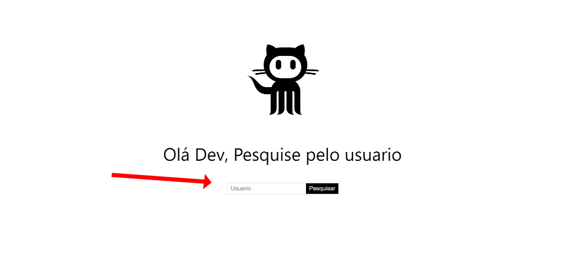
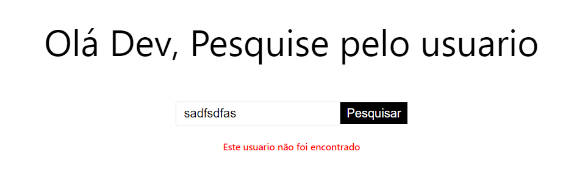
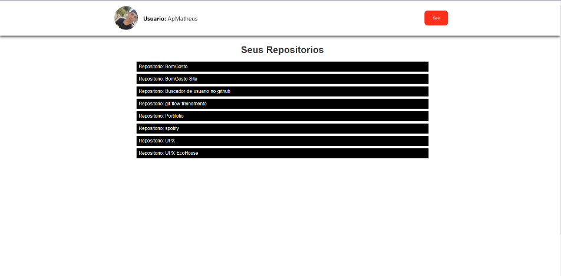

# Buscador de usuarios no github
 
## Contexto:
* Projeto criando de forma didatica durante o bootcampo da [Hiring Coders](https://www.hiringcoders.com.br/) em conjunto com a [Gama Academy](https://www.gama.academy/?&utm_source=googleutm_medium=paid-search&utm_campaign=brand-awareness&utm_term=gama-academy&gclid=CjwKCAjwy_aUBhACEiwA2IHHQA98b0nRL5VocWbeedNiyQelbhPCbe-owirH18R72wO5kagdTjnJgBoCXVMQAvD_BwE);
 
* Este projeto é um dos meus primeiros projetos desenvoldidos em [ReactJs](https://pt-br.reactjs.org/) e consumindo a API do Github para fazer as requisições das informações dos usuários buscados;
 
 
## Objetivo:
* O projeto tem fins didáticos, colocando em prática os conhecimentos em ReactJs, HTML, CSS, JS, Node e APIs.
* O Projeto faz uma requisição na API do GitHub buscando pelo nome do usuário digitado, e retorna os seus respectivos repositórios.
 
## Funcionamento:
Na Home do projeto basta buscar inserir o nome do usuário que deseja encontrar e logo em seguida clicar no botão buscar.
 

 
Caso o usuário digitado não tenha conta no GitHub ou se o nome foi inserido de maneira incorreta, uma mensagem será exibida logo abaixo e será necessário digitar um usuário válido para continuar a busca.
 

 
Após digitar um usuário correto e clicar em buscar, será feito a requisição com a API do GitHub e serão trazidos os dados e armazenados dentro do LocalStorage e exibido os repositórios do usuário buscado, conforme na imagem ilustrada abaixo.
 

 
Neste momento todos os repositórios públicos do usuário serão exibidos em forma de lista, além disso pode-se observar que sua imagem de perfil também foi buscada e exibida no Header da página juntamente com o seu nome de usuário.
Caso queira buscar outros usuários, basta clicar em "Sair", no canto superior direito e assim irá retornar a Home, possibilitando a busca de outros usuários. Vale ressaltar também que ao clicar em "Sair" os dados armazenados no LocalStorage serão apagados.
 
 
## Agradecimetos:

* Deixo aqui registrado também meus agradecimentos a [Hiring Coders](https://www.hiringcoders.com.br/) e a [Gama Academy](https://www.gama.academy/?&utm_source=googleutm_medium=paid-search&utm_campaign=brand-awareness&utm_term=gama-academy&gclid=CjwKCAjwy_aUBhACEiwA2IHHQA98b0nRL5VocWbeedNiyQelbhPCbe-owirH18R72wO5kagdTjnJgBoCXVMQAvD_BwE), por todo apredizao até o momento;

